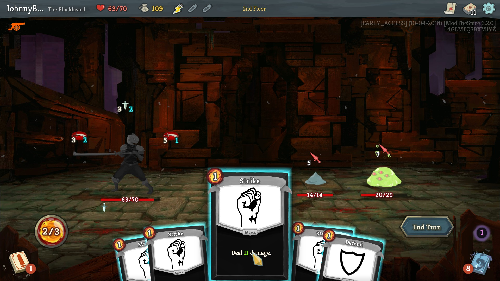
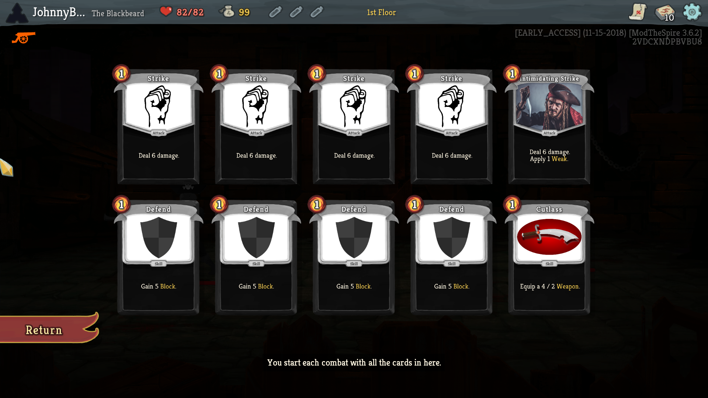

# StSModTheBlackbeard
This mod adds a new character for Slay The Spire, named The Blackbeard, with 75 brand new cards and 12 new relics (1 starter, 4 common, 3 uncommon, 2 rare, 1 boss and 1 shop). 

The Blackbeard is a new class based on pirate theme. His most important mechanic are Weapons. There are many cards that allow to Equip a Weapon and each Weapon is characterized by its Attack and Durability. You can equip many Weapons, and they are queued using Defect's orb system. Every time you play an attack card, one Durability of your rightmost Weapon is used and card's damage is increased by Weapon's attack. You can Equip maximum of 10 Weapons. Weapons with zero durability are automatically destroyed. Orb slots are created automatically when you equip a Weapon and are automatically destroyed when Weapon is destroyed.

Other mechanics are: 
- Cannonballs - 0 cost attacks that deal 8 (10) damage and exhaust.
- Resistance - for each point of Resistance enemies deal 1 damage less.
- Gold scaling cards - some cards scale with how much Gold you gained this run.
- Debuff cleansing - The Blackbeard is able to play powerful cards with negative effects, and later cleanse his debuffs.

Gameplay: 


Starting deck: 


List of all cards can be find [here](/cards/cardlist.md). (Exported using [Slay the Spire exporter](https://github.com/twanvl/sts-exporter))

## Requirements ##

* Java 8 (JRE).
* Newest version of ModTheSpire (https://github.com/kiooeht/ModTheSpire/releases)
* Newest version of BaseMod (https://github.com/daviscook477/BaseMod/releases)

## Installation ##
1. Go to folder where your Slay The Spire is installed, for example: "C:\Program Files (x86)\Steam\steamapps\common\SlayTheSpire"
2. Copy ModTheSpire files (ModTheSpire.jar, MTS.cmd, MTS.sh) to this folder.
3. Create a new folder named "mods".
4. Copy BaseMod.jar and TheBlackbeardMod.jar into folder "mods".
5. Double click on MTS.cmd, select "BaseMod" and "The Blackbeard", and click "Play" button.

## Set Ascension Level to 20 (optional) ##

If you want to play Ascension 20 straight away, you have to:
1. Go to your Slay the Spire preferences folder for example: "C:\Program Files (x86)\Steam\steamapps\common\SlayTheSpire\preferences".
2. Open file named "BLACKBEARD_CLASS". If there is no such file, then simply create it (it has no extension).
3. You have to add property "ASCENSION_LEVEL" with value "20", and ensure that value of property "WIN_COUNT" is bigger than 0. If you just created the file, you can copy and paste this:
```
{
  "ASCENSION_LEVEL": "20",
  "WIN_COUNT": "1"
}
```

## Special Thanks ##
1. Thanks to the [developers](https://www.megacrit.com/) of **SlayTheSpire** for making such a good game.
2. Thanks to the creators of ModTheSpire and BaseMod for creating great tools for modding.
3. Thanks to the community of [Pixabay](https://pixabay.com) for many great, free images that I used for this mod. 
4. Thanks to [JoINrbs](https://www.twitch.tv/joinrbs) for great and educational Slay the Spire streams.

## Other Mods ##
List of other mods can be found at:
* https://github.com/kiooeht/ModTheSpire/wiki/List-of-Known-Mods

The Blackbeard fully supports the [Googly Eyes](https://github.com/twanvl/sts-googly-mod/releases) mod. If you like to play with hilarious googly eyes on almost every card, then you are most welcome :) 

## Contact ##
- To report a bug, please create an [issue](https://github.com/JohnnyBazooka89/StSModTheBlackbeard/issues). You can also find me on Slay the Spire discord, on channel #unsupported-modding (my nickname: JohnnyBazooka89#8560).