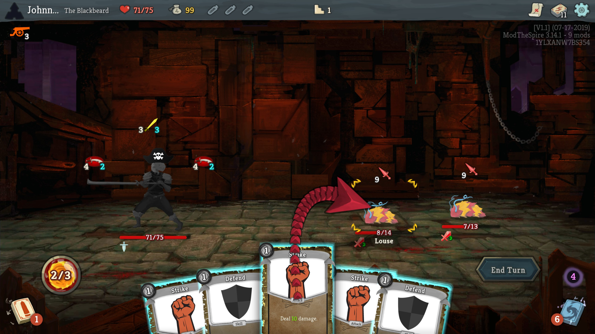
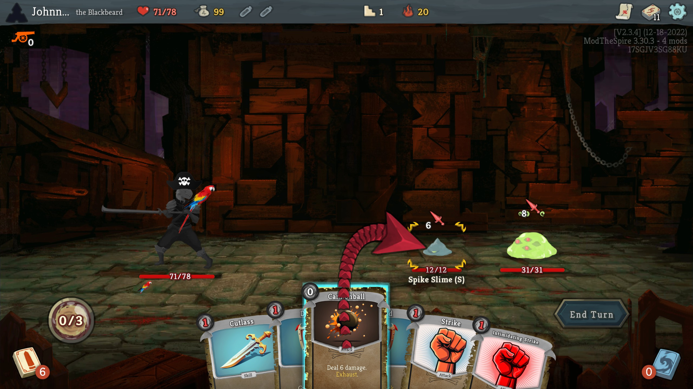
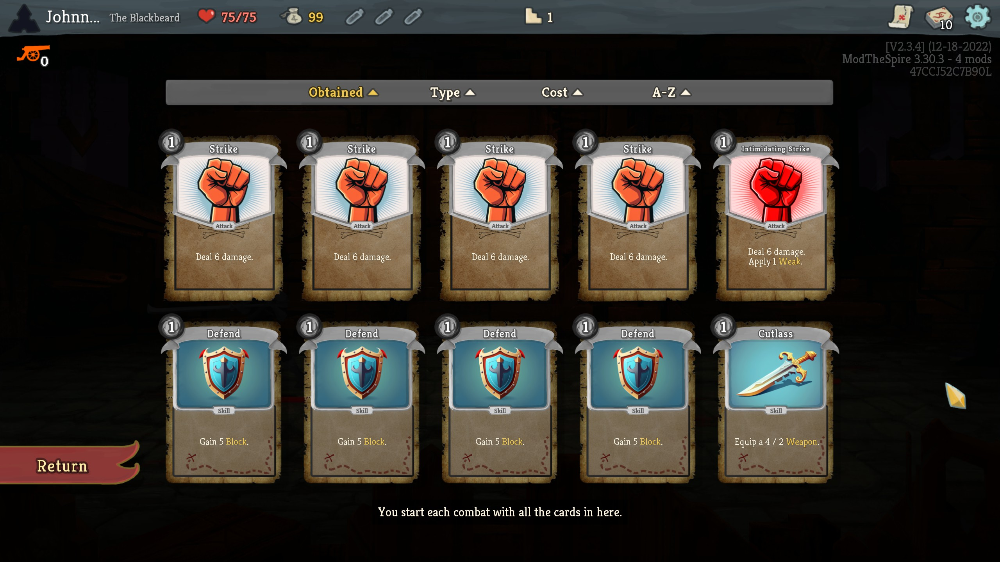

# StSModTheBlackbeard

**Update: Slay the Spire added the official Workshop for mods. Please check [Installation](#installation) section for more details.** 

This mod adds a new character for Slay the Spire, named The Blackbeard, with 75+ new cards and 15 new relics (1 starter, 4 common, 3 uncommon, 2 rare, 3 boss and 2 shop). 

The Blackbeard is a new class based on pirate theme. His most important mechanic are Weapons. There are many cards that allow to equip a Weapon and each Weapon is characterized by its Attack and Durability. You can equip many Weapons, and they are queued using Defect's orb system. Every time you play an attack card, one Durability of your rightmost Weapon is used and card's damage is increased by Weapon's Attack. You can equip maximum of 10 Weapons. Weapons with zero Durability are automatically destroyed. Orb slots are created and destroyed automatically.

Other mechanics are: 
- Cannonballs - 0 cost attacks that deal 6 (8) damage and exhaust.
- Resistance - for each point of Resistance you take 1 damage less from enemies.
- Gold scaling cards - some cards scale with how much Gold you gained this run.
- Debuff cleansing - The Blackbeard is able to play powerful cards with negative effects, and later cleanse his debuffs.

Gameplay: 



Starting deck: 


List of all cards, relics and potions can be found [here](http://www.theblackbeardmod.com). (Exported using [Slay the Spire exporter](https://github.com/twanvl/sts-exporter).)

## Installation ##
1. Subscribe to the mod on [mod's workshop page](https://steamcommunity.com/sharedfiles/filedetails/?id=1612105245).
2. The instruction how to play with mods can be found [here](https://steamcommunity.com/games/646570/announcements/detail/1714081669582224415).

## Set Ascension Level to 20 (optional) ##

If you want to play Ascension 20 straight away, you have to:
1. Go to your Slay the Spire preferences folder for example: "C:\Program Files (x86)\Steam\steamapps\common\SlayTheSpire\preferences".
2. Open file named "BLACKBEARD_CLASS". If there is no such file, then simply create it (it has no extension).
3. You have to add property "ASCENSION_LEVEL" with value "20", and ensure that value of property "WIN_COUNT" is bigger than 0. If you just created the file, you can copy and paste this:
```
{
  "ASCENSION_LEVEL": "20",
  "WIN_COUNT": "1"
}
```

## Localizations ##
The mod is available in:
- English
- Polish
- Russian, thanks to [Jedi](https://github.com/Jedi515).

## Special Thanks ##
1. Thanks to the [developers](https://www.megacrit.com/) of **SlayTheSpire** for making such a good game.
2. Thanks to the creators of ModTheSpire and BaseMod for creating great tools for modding.
3. Thanks to the community of [Pixabay](https://pixabay.com) for many great, free images that I used for this mod. 
4. Thanks to [JoINrbs](https://www.twitch.tv/joinrbs) for great and educational Slay the Spire streams.

## Other Mods ##
- Other mods can be found on [Slay the Spire official workshop](https://steamcommunity.com/app/646570/workshop/).

The Blackbeard fully supports the [Googly Eyes](https://steamcommunity.com/sharedfiles/filedetails/?id=1615430126) mod. If you'd like to play with hilarious googly eyes on almost every card, then you are most welcome :) 

## Contact ##

- To report a bug in the code, please create an [issue](https://github.com/JohnnyBazooka89/StSModTheBlackbeard/issues). If you want to make general remarks, feel free to [comment](https://steamcommunity.com/sharedfiles/filedetails/comments/1612105245) or create a [discussion](https://steamcommunity.com/sharedfiles/filedetails/discussions/1612105245) on mod's workshop page.