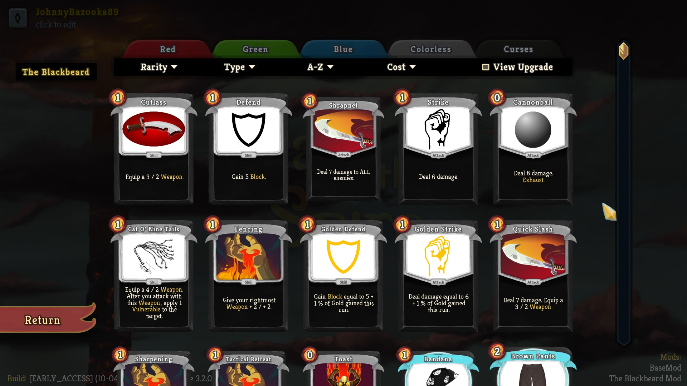
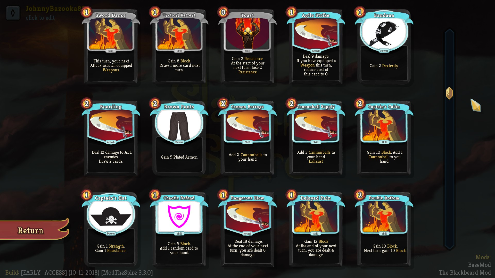

# StSModTheBlackbeard
This mod adds a new character for Slay The Spire, named The Blackbeard. Currently ~20 cards of 75 planned are finished. Mod is currently under intensive development, so if you want to just play it, then please wait until it is finished and tested properly.

The Blackbeard is a new class based on pirate theme. His most important mechanic are Weapons. There are many cards that allow to Equip a Weapon and each Weapon is characterized by its Attack and Durability. You can equip many weapons, and they queued using Defect's orb system. Every time you deal play an Attack card, one Durability of your rightmost Weapon is used and damage dealt is increased by weapon's Attack. You can Equip maximum of 10 weapons. Weapons with zero durability are automatically destroyed. Orb slots are created automatically when you equip a Weapon and are automatically destroyed when Weapon is destroyed.

Other mechanics are: 
- Cannonballs - 0 cost attacks that deal 8 (12) damage and exhaust.
- Resistance - for each point of Resistance enemies deal 1 damage less
- Gold scaling card - some cards scale with how much Gold you gained this run
- Debuff cleansing - Blackbeard is able to play powerful cards with negative effects, and later cleanse his debuffs

Gameplay: 

Starting deck: 

Currently developed cards:

## Requirements ##

* Java 8 (JRE).
* Newest version of ModTheSpire (https://github.com/kiooeht/ModTheSpire/releases)
* Newest version of BaseMod (https://github.com/daviscook477/BaseMod/releases)

## Installation ##
1. Go to folder where your Slay The Spire is installed, for example: "C:\Program Files (x86)\Steam\steamapps\common\SlayTheSpire"
2. Copy ModTheSpire files (ModTheSpire.jar, MTS.cmd, MTS.sh) to this folder.
3. Create new folder named "mods".
4. Copy BaseMod.jar and TheBlackbeardMod.jar into folder "mods".
5. Double click on MTS.cmd and  

Here is a great video showing how to install mods, by Xterminator: https://www.youtube.com/watch?v=r2m2aL1eEjw

## Special Thanks ##
1. Thanks to the [developers](https://www.megacrit.com/) of **SlayTheSpire** for making such a good game.
2. Thanks to the creators of ModTheSpire and BaseMod for making great tools for modding.
3. Thanks to [JoINrbs](https://www.twitch.tv/joinrbs) for great and educational Slay the Spire streams.

## Other Mods ##
List of other mods can be found at:
* https://github.com/kiooeht/ModTheSpire/wiki/List-of-Known-Mods

## Contact ##
If you want to contact me, please send an e-mail to johnnybazooka89 \_a_t_ gmail dot com.