| Name | Image | Upgraded image | Rarity | Type | Cost | Description |
| ---- | ----- | -------------- | ------ | ---- | ---- | ----------- |
| Cutlass | 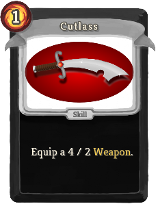 |  | Basic | Skill | 1(0) | Equip a 4 / 2 Weapon. |
| Defend | 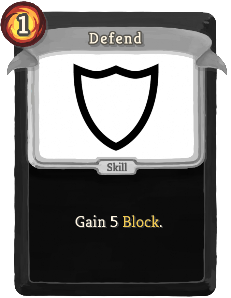 |  | Basic | Skill | 1 | Gain 5(8) Block. |
| Strike |  |  | Basic | Attack | 1 | Deal 6(9) damage. |
| Beat Up |  | 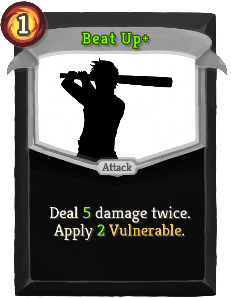 | Common | Attack | 1 | Deal 4(5) damage twice. Apply 1(2) Vulnerable. |
| Blind Attacks | 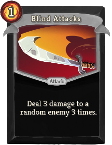 | 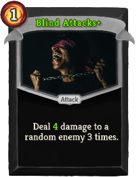 | Common | Attack | 1 | Deal 3(4) damage to a random enemy 3 times. |
| Cat O' Nine Tails | 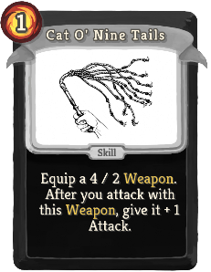 | 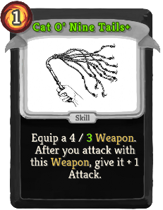 | Common | Skill | 1 | Equip a 4 / 2(3) Weapon. After you attack with this Weapon, give it + 2 Attack. |
| Cloak And Cannonball | 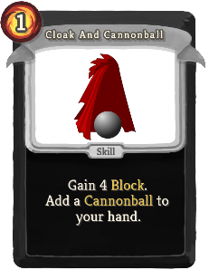 | 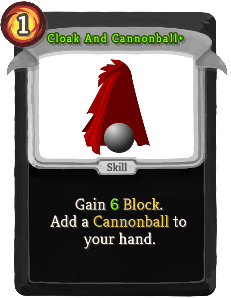 | Common | Skill | 1 | Gain 4(6) Block. Add a Cannonball to your hand. |
| Dagger | 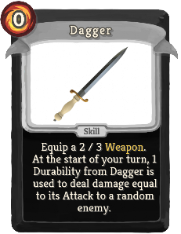 | 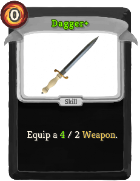 | Common | Skill | 0 | Equip a 2(3) / 2 Weapon. |
| Delayed Pain | 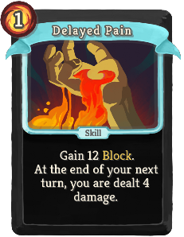 | 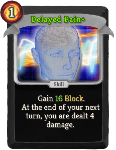 | Common | Skill | 1 | Gain 12(16) Block. At the end of your next turn, you are dealt 4 damage. |
| Golden Defend | 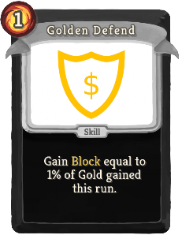 | 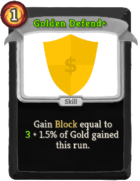 | Common | Skill | 1 | Gain Block equal to (0(3) +) 1.5% of Gold gained this run. |
| Golden Strike | 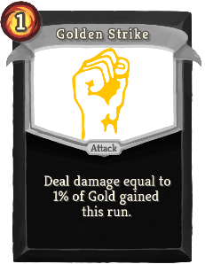 | 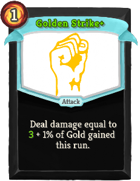 | Common | Attack | 1 | Deal damage equal to (0(3) +) 1.5% of Gold gained this run. |
| Intimidating Strike |  | 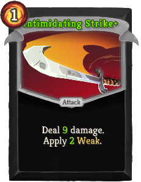 | Common | Attack | 1 | Deal 6(9) damage. Apply 1(2) Weak. |
| Pirate's Will | 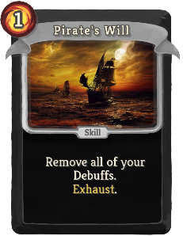 | 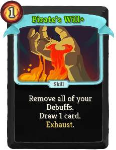 | Common | Skill | 1(0) | Remove all of your Debuffs. Exhaust. |
| Quick Slash | 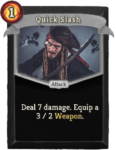 | 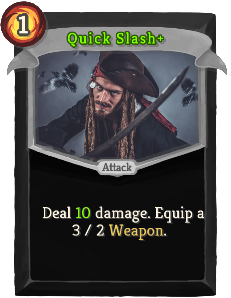 | Common | Attack | 1 | Deal 7(10) damage. Equip a 3 / 2 Weapon. |
| Sharpening |  |  | Common | Skill | 1 | Give all your equipped Weapons + 2(3) attack. |
| Shrapnel | 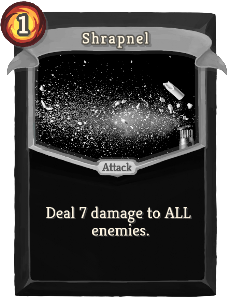 |  | Common | Attack | 1 | Deal 7(10) damage to ALL enemies. |
| Spear | 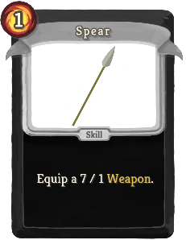 | 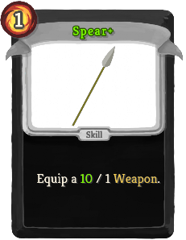 | Common | Skill | 1 | Equip a 7(10) / 1 Weapon. |
| Sword | 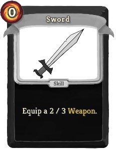 | 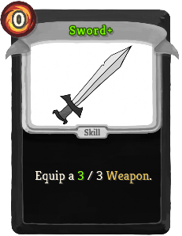 | Common | Skill | 1 | Choose 1 of 3 Swords. Equip a 2(3) / 3 Weapon with an additional effect. |
| Sword Dance | 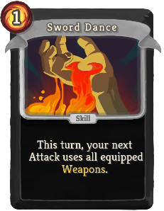 | 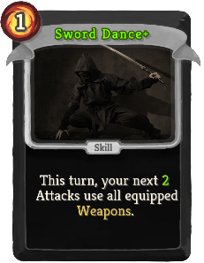 | Common | Skill | 1 | This turn, your next (1(2)) Attack(s) uses (use) all equipped Weapons. |
| Tactical Retreat | 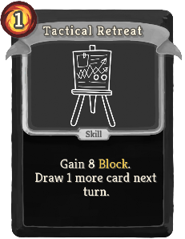 | 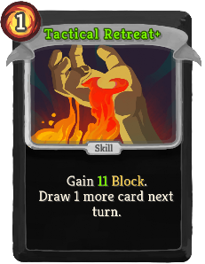 | Common | Skill | 1 | Gain 8(11) Block. Draw 1 more card next turn. |
| Toast |  |  | Common | Skill | 0 | Gain 2(3) Resistance. At the start of your next turn, lose 2(3) Resistance. Exhaust. |
| Agile Strike | 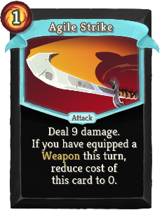 |  | Uncommon | Attack | 1 | Deal 9(13) damage. If you have equipped a Weapon this turn, reduce cost of this card to 0. |
| Anchor |  | 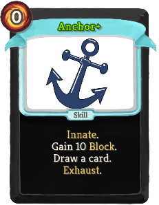 | Uncommon | Skill | 0 | Innate. Gain 10 Block. (Draw a card.) Exhaust. |
| Armor Up | 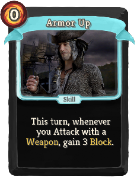 | 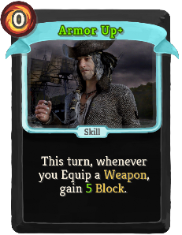 | Uncommon | Skill | 0 | This turn, whenever you Attack with a Weapon, gain 3(5) Block. |
| Bandana |  | 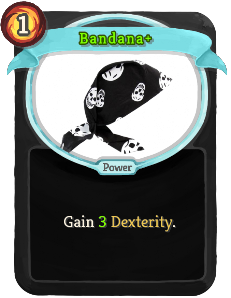 | Uncommon | Power | 1 | Gain 2(3) Dexterity. |
| Boarding | 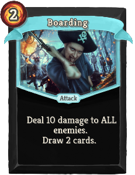 | 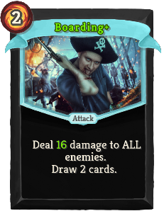 | Uncommon | Attack | 2 | Deal 12(16) damage to ALL enemies. Draw 2 cards. |
| Brown Pants | 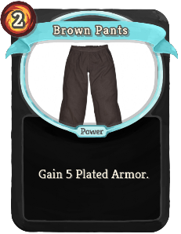 |  | Uncommon | Power | 2 | Gain 5(6) Plated Armor. |
| Buried Treasure | 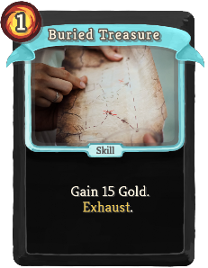 |  | Uncommon | Skill | 1 | Gain 15(20) Gold. Exhaust. |
| Cannon Barrage |  | 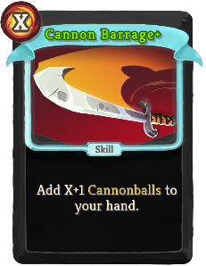 | Uncommon | Skill | X | Add X (X+1) Cannonballs to your hand. |
| Cannonball Supply | 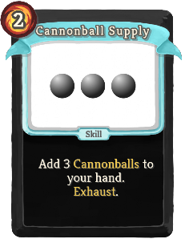 | 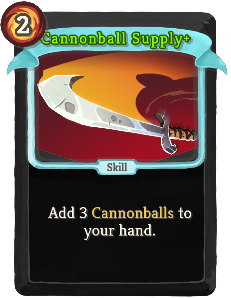 | Uncommon | Skill | 2 | Add 3 Cannonballs to your hand. Exhaust. (not Exhaust.) |
| Captain's Cabin | 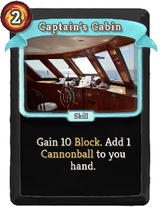 |  | Uncommon | Skill | 2 | Gain 10(12) Block. Add 1(2) Cannonball(s) to your hand. |
| Chaotic Defend | 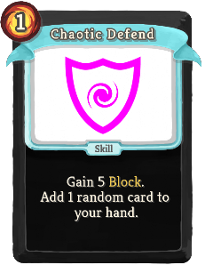 | 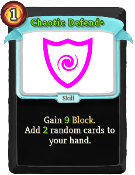 | Uncommon | Skill | 1 | Gain 7(9) Block. Add 1(2) random card(s) to your hand. |
| Dagger Accumulation | 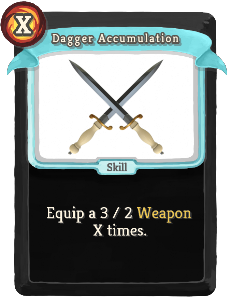 | 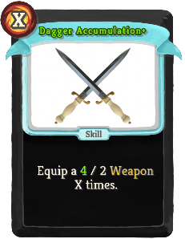 | Uncommon | Skill | X | Equip a 2(3) / 2 Weapon X times. |
| Dangerous Blow |  | 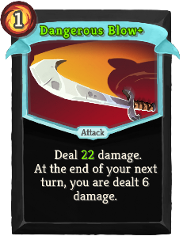 | Uncommon | Attack | 1 | Deal 18(22) damage. At the end of your next turn, you are dealt 6 damage. |
| Double Bottom | 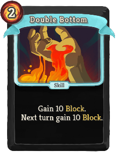 |  | Uncommon | Skill | 2 | Gain 10(13) Block. Next turn gain 10(13) Block. |
| Double Cannonball |  |  | Uncommon | Attack | 1 | Deal 8(10) damage. Exhaust. Add a (an upgraded) Cannonball to your hand. |
| Eyepatch |  |  | Uncommon | Power | 0 | (Innate.) Gain 3 Weak. At the start of your turn, draw 1 additional card. |
| Fencing |  |  | Uncommon | Skill | 1 | Give your rightmost Weapon + 2(3) / + 2(3). |
| Fishing Nets |  |  | Uncommon | Power | 2 | Gain 6(10) Thorns. |
| Ghost In The Rum |  |  | Uncommon | Skill | 1 | Gain 1 Intangible. Lose 2(1) Resistance. Exhaust. |
| Golden Cannonball |  |  | Uncommon | Attack | 0 | Deal damage equal to (0(4) +) 2% of Gold gained this run. Exhaust. |
| Infinite Barrage |  |  | Uncommon | Power | 2 | (Innate.) At the start of each turn, add a Cannonball card to your hand. |
| Jolly Roger |  |  | Uncommon | Skill | 1 | Apply 3(5) Weak to ALL enemies. Exhaust. |
| Keelhauling |  |  | Uncommon | Skill | 2 | Targeted enemy is dealt 8 damage at the start of their turn. Lasts for 2(3) turns. |
| Pirate Earring |  |  | Uncommon | Power | 0 | Gain 1(2) Artifact. |
| Powder Keg |  |  | Uncommon | Skill | 1 | Equip a 0 / 1 Weapon. When it is destroyed, deal 15(20) damage to ALL enemies. |
| Provisioning |  |  | Uncommon | Skill | 1(0) | Obtain a random potion. Exhaust. |
| Recklessness |  |  | Uncommon | Skill | 0 | Gain [R] [R] ([R]). At the start of your next turn, lose [R] [R]. |
| Recycle |  |  | Uncommon | Skill | 0 | Destroy your rightmost Weapon to gain (NL) [R] [R] ([R]). |
| Remove Scurvy |  |  | Uncommon | Skill | 1(0) | Heal 10% of your maximum HP. Remove all of your Debuffs. Exhaust. |
| Revenge |  |  | Uncommon | Attack | 2 | Deal 0 - 40(50) damage to ALL enemies, based on how many % of HP you are missing. Max damage at 1 HP. |
| Rum |  |  | Uncommon | Power | 1 | Gain 2(3) Resistance. |
| Smithing Hammer |  |  | Uncommon | Skill | 1 | Equip a 2(3) / 4 Weapon. After you attack with this Weapon, upgrade a random card in your hand for the rest of the combat. |
| Terror Of The Seas |  |  | Uncommon | Skill | 1 | Apply 3(5) Vulnerable to ALL enemies. Exhaust. |
| Upgrade |  |  | Uncommon | Skill | 1 | Give all your equipped Weapons + 1(2) / + 1(2). |
| Vengeful Spirit |  |  | Uncommon | Skill | 1 | Gain 1 Intangible. At the end of your next turn, you are dealt 10(6) damage. Exhaust. |
| Wise Defend |  |  | Uncommon | Skill | 1 | Gain 7(9) Block. Draw 1(2) card(s). |
| Wooden Leg |  |  | Uncommon | Power | 1 | Lose 2 Dexterity. Gain 4(5) Strength. |
| Boost Morale |  |  | Rare | Skill | 0 | Draw 2(3) cards. Gain [R] ([R]). Exhaust. |
| Bounty Hunter |  |  | Rare | Attack | 1 | Deal 16(20) damage. If this kills a non-minion enemy, gain 16(20) Gold. Exhaust. |
| Captain's Hat |  |  | Rare | Power | 2 | Gain 2(3) Strength. Gain 2(3) Resistance. |
| Final Barrage |  |  | Rare | Attack | 0 | Deal damage equal to 4(6) times the amount of Cannonballs played this combat (every type of Cannonball counts). |
| Golden Guillotine |  |  | Rare | Attack | 3 | Deal damage equal to 4(5) percent of Gold gained this run. |
| Golden Rain |  |  | Rare | Attack | 2 | Deal damage equal to 2.5% (3%) of Gold gained this run to ALL enemies. |
| Halberd |  |  | Rare | Skill | 2 | Equip a 7(10) / 4 Weapon. |
| Humongous Cannonball |  |  | Rare | Attack | 3 | Deal 36(48) damage. Exhaust. |
| Intoxication |  |  | Rare | Power | 1 | Gain 4(5) Resistance. At the start of each turn, lose 1 Resistance. |
| Lifeboat |  |  | Rare | Skill | 2 | Gain 24(30) Block. |
| Mega Upgrade |  |  | Rare | Skill | 2 | Give all your equipped Weapons + 3(5) / + 3(5). |
| Murder |  |  | Rare | Attack | 4 | Deal 250(500) damage���� to Normal monster. (Cannot be used on Elite or Boss). Ethereal. |
| Parrot |  |  | Rare | Power | 3 | The last card played each turn is played an additional time. This power does not stack. Ethereal. (not Ethereal.) |
| Pirate Strength |  |  | Rare | Power | 3 | Gain 6(9) Strength. |
| Salvager |  |  | Rare | Power | 2(1) | Whenever a Weapon is destroyed, gain [R]. |
| The Drunken Sailor |  |  | Rare | Power | 1(0) | Increase the effectiveness of your potions 2 times. |
| Weapon Mastery |  |  | Rare | Power | 2(1) | Whenever you Equip a Weapon, draw 1 card. |
